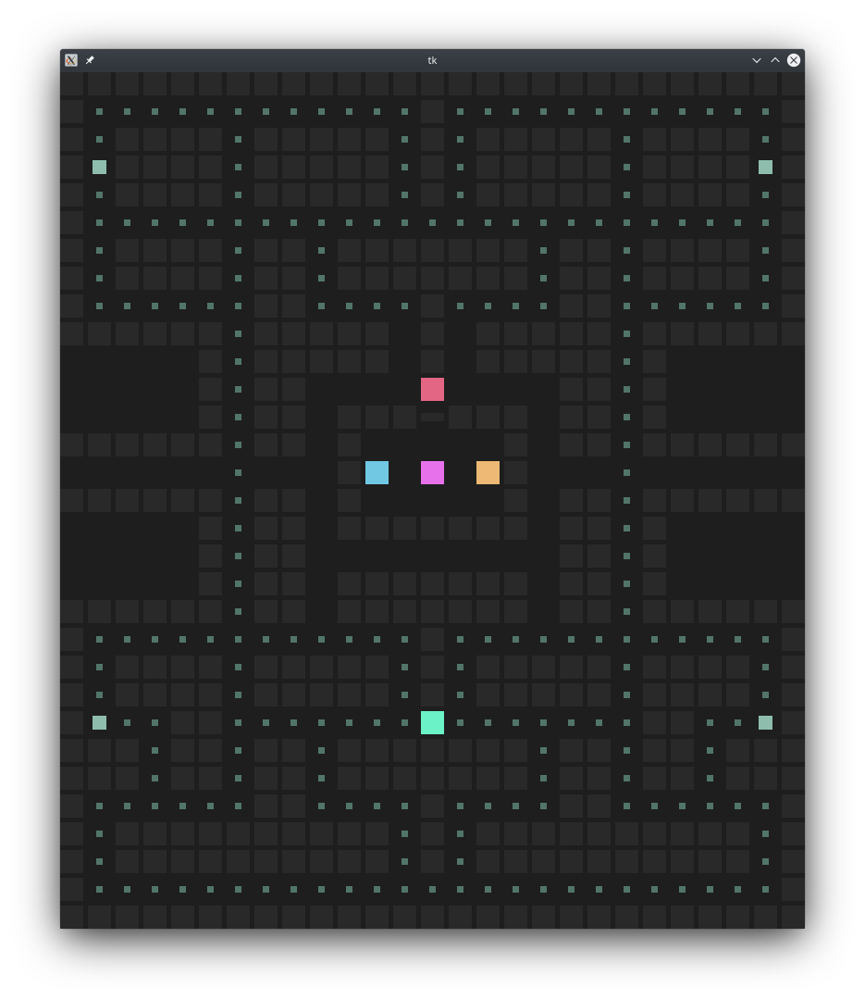

# PACMAN with modified ghost AI

    

# TODO LIST

## Research

- Pacman Ghost AI
- Input Dimensions for  Pacman AI
- Improvement Methods for Ghost AI

---

## Implementation

### General

- Documentations

### Control Group (Classic behaviour)

- pacman kill mode

### Pacman AI (Neural Q / Neural Expected Sarsa)

---

## AI Improvement 

### Improvement 1 (Algorithmic AI)

### Improvement 2 (Neural Q / Neural Expected Sarsa)

### Improvement 3 (NeuroEvolution / Genetic Algorithms)
